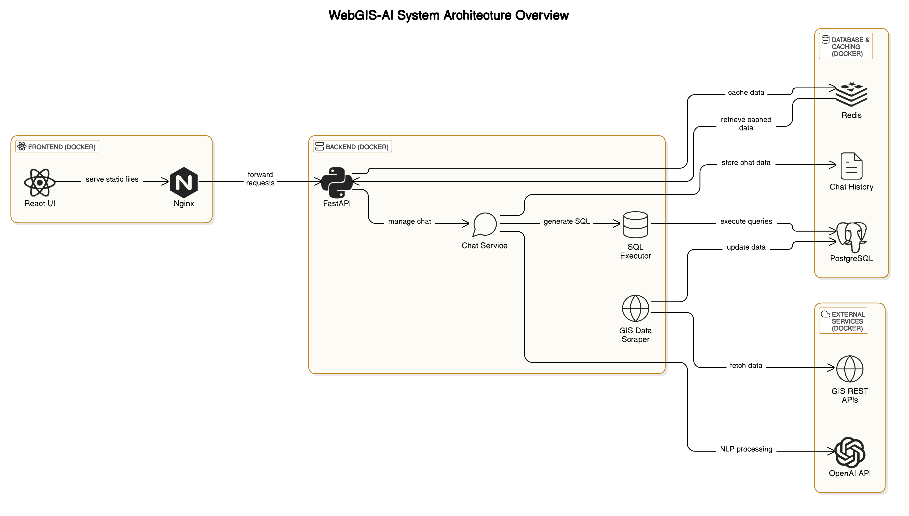

# WebGIS-AI



## Innovation Overview

WebGIS-AI is a groundbreaking platform that uniquely combines generative AI technologies such as ChatGPT with Geographic Information Systems (GIS). Unlike traditional GIS solutions, WebGIS-AI pioneers a scalable, microservice-based architecture enabling dynamic spatial querying, real-time analytics, and automated map generation through natural language processing.

Traditional GIS environments often lack:
- Built-in mechanisms to execute advanced SQL queries directly
- Dynamic data interrogation capabilities
- Accessibility for non-GIS specialists

WebGIS-AI addresses these limitations by leveraging AI-driven natural language processing to simplify complex geospatial tasks, significantly enhancing efficiency and reducing manual GIS workflows.

## Significance

WebGIS-AI democratizes access to advanced geospatial analytics by:

- Leveraging open-source technology to lower barriers to GIS adoption
- Enabling users without specialized GIS knowledge to execute complex spatial queries using simple English prompts (e.g., "Show me all the city-owned cast-iron water mains over 50 years old")
- Addressing critical gaps in open-source GIS tools: ease of use, accessibility, and interactive querying
- Expanding GIS technology usage to asset managers, planners, municipal authorities, and other non-expert stakeholders

## Impact

WebGIS-AI significantly impacts the open-source GIS community by:

- Pioneering a new era of AI-enabled geospatial analytics
- Setting a benchmark for future integration of AI with spatial analysis and open data
- Offering a scalable, unified platform integrating municipal infrastructure data
- Making advanced geospatial analysis accessible through intuitive natural language queries

For context, Ontario's municipal infrastructure alone represents an asset base of approximately $500 billion, scaling up to over $2 trillion across Canada. WebGIS-AI addresses inefficiencies due to lack of unified open standards that currently lead to resource duplication among consultants, municipalities, and contractors.

## Benefits and Results

WebGIS-AI delivers substantial benefits including:

- Significant improvements in workflow efficiency
- Enhanced query accuracy
- Wider accessibility to advanced GIS functionality
- Rapid insights into infrastructure conditions
- Predictive maintenance capabilities
- Strategic capital planning support

Real-world applications demonstrate:
- A typical GIS analyst can reclaim nearly 800 hours annually
- Translates to approximately $80,000 in annual savings for organizations employing just three GIS analysts
- Benefits scale dramatically for larger teams and multiple sectors

## Key Features

### Map Controls
- **Zoom Control**: Zoom in/out functionality
- **Home Extent**: Return to initial map view
- **Layer Management**: Toggle layers on/off
- **Feature Attributes**: View detailed information about map features

### AI Chat Integration
- **Natural Language Queries**: Use plain English to perform complex spatial analysis
- **Data Enrichment**: AI-powered context addition to geospatial data
- **Dynamic Visualization**: Generate visualizations based on queries

### Advanced Capabilities
- **Dynamic Data Ingestion**: Import and process various geospatial data formats
- **Spatial Analysis**: Perform complex spatial operations and queries
- **Custom Visualization**: Create tailored maps and data representations

## System Architecture

WebGIS-AI consists of several microservices:

1. **PostgreSQL/PostGIS Database**: Stores and manages spatial data
2. **Python Scraper**: Collects and processes data from various sources
3. **FastAPI Backend**: Handles API requests and business logic
4. **Redis Cache**: Improves performance for repeated queries
5. **QGIS Service**: Performs specialized geospatial processing
6. **React Frontend**: Provides the user interface

## Installation

To get started with WebGIS-AI:

1. **Clone the repository**:
   ```
   git clone https://github.com/jbelloRepo/WebGIS-AI.git
   cd WebGIS-AI
   ```

2. **Set up environment variables**:
   Create or edit the `.env` file with necessary API keys:
   ```
   OPENAI_API_KEY=your_openai_api_key_here
   ```

3. **Start the services using Docker**:
   ```
   docker-compose up -d
   ```

4. **Access the application**:
   Open your browser and navigate to `http://localhost:3000`

## Usage

Once the application is running:

1. **Interactive Map**: Navigate the map using the zoom and pan controls
2. **Layer Selection**: Toggle various data layers using the layer control
3. **AI Chat**: Use the chat interface to ask questions about the data:
   - "Show me all schools within 500m of major roads"
   - "Identify flood-prone areas near residential zones"
   - "Calculate the total length of water mains installed before 1970"

## Technologies Used

- **PostgreSQL/PostGIS**: Spatial database
- **Python**: Backend processing and AI integration
- **FastAPI**: API framework
- **Redis**: Caching
- **QGIS**: Advanced geospatial processing
- **React**: Frontend framework
- **Docker**: Containerization

## PostGIS Functions

WebGIS-AI leverages numerous PostGIS functions for spatial analysis, including:

### Basic Functions
- `avg(expression)`: Returns the average value of a numeric column
- `count(expression)`: Returns the number of records in a set
- `sum(expression)`: Returns the sum of records in a set

### Spatial Relationship Functions
- `ST_Contains(geometry A, geometry B)`: Returns true if no points of B lie in the exterior of A
- `ST_Crosses(geometry A, geometry B)`: Returns TRUE if the geometries have some interior points in common
- `ST_Disjoint(geometry A, geometry B)`: Returns TRUE if the geometries do not share any space
- `ST_Distance(geometry A, geometry B)`: Returns the minimum distance between two geometries
- `ST_DWithin(geometry A, geometry B, radius)`: Returns true if geometries are within specified distance
- `ST_Equals(geometry A, geometry B)`: Returns true if geometries represent the same geometry
- `ST_Intersects(geometry A, geometry B)`: Returns TRUE if geometries share any portion of space
- `ST_Overlaps(geometry A, geometry B)`: Returns TRUE if geometries share space but aren't contained by each other
- `ST_Touches(geometry A, geometry B)`: Returns TRUE if geometries have at least one point in common
- `ST_Within(geometry A, geometry B)`: Returns true if geometry A is completely inside geometry B

For more information on PostGIS functions, refer to the [PostGIS documentation](https://postgis.net/workshops/postgis-intro/index.html).

## Contributing

We welcome contributions from the community! To contribute:

1. Fork the repository
2. Create a feature branch (`git checkout -b feature/amazing-feature`)
3. Commit your changes (`git commit -m 'Add some amazing feature'`)
4. Push to the branch (`git push origin feature/amazing-feature`)
5. Open a Pull Request

## License

This project is licensed under the MIT License - see the [LICENSE](LICENSE) file for details.

## Contact

- **Project Lead**: Jubril Bello
- **GitHub**: [jbelloRepo](https://github.com/jbelloRepo)
